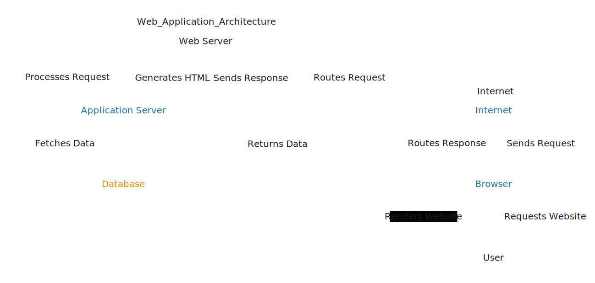

# Web Development

#### Web Development and How the Internet Works

Web development is the process of creating websites and web applications that run on the Internet or a private network. It encompasses various disciplines including web design, web content development, client-side/server-side scripting, and network security configuration.

**How the Internet Works**

The Internet is an expansive network consisting of interconnected systems that utilize the Internet Protocol Suite (TCP/IP) for communication. It operates on a client-server model, allowing devices globally to connect and exchange information efficiently.

**How DNS Works in the Internet**

The Domain Name System (DNS) is a critical component of the Internet infrastructure, functioning much like a phonebook for the web. Its primary purpose is to translate human-friendly domain names, such as www.example.com, into numerical IP addresses, like 192.0.2.1, which computers use to communicate with one another.

When you type a domain name into your browser's address bar, your computer initiates a DNS query to resolve the domain into its corresponding IP address. This process involves several steps and interactions with different types of DNS servers:

1. **Recursive Resolver**: This is the server that receives your DNS query first. It acts on your behalf to find the IP address. It may temporarily store DNS responses (caching) to speed up future queries for the same domain.
2. **Root Nameserver**: If the recursive resolver doesn't have the domain information cached, it queries a root nameserver. There are 13 sets of root nameservers around the world which manage the top-level domain (TLD) records, pointing the resolver towards the appropriate TLD nameserver (e.g., .com, .org, .net).
3. **TLD Nameserver**: The TLD nameserver maintains information for all domain names within a top-level domain. It directs the recursive resolver to the correct authoritative nameserver that hosts the domain's DNS records.
4. **Authoritative Nameserver**: Finally, the authoritative nameserver provides the requested IP address for the domain name. It holds the specific DNS records for the domain, such as A records (IPv4 addresses) or AAAA records (IPv6 addresses).

Once the recursive resolver obtains the IP address from the authoritative nameserver, it sends it back to your browser, which then establishes a connection to the web server using that IP address, allowing you to view the desired website.

This efficient and hierarchical system ensures that DNS queries are resolved quickly while distributing the load among different servers, enabling scalable and reliable Internet operations.

